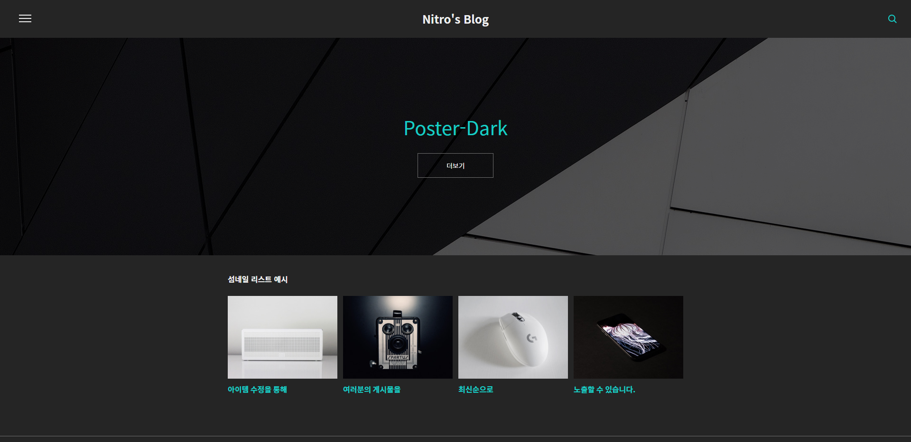
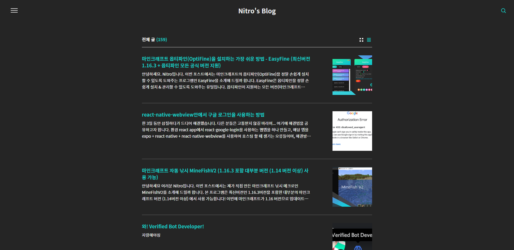
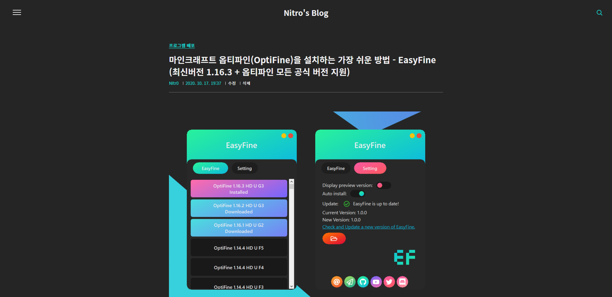
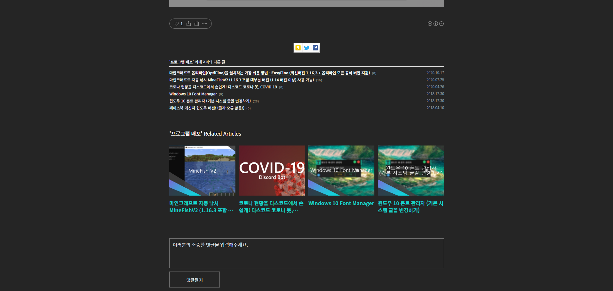

# Poster-Dark
#### Keep your and your reader's eyes comfortable 😎

A Dark theme of Tistory's Poster skin. You can check more details on [here](https://nitr0.tistory.com/).

## Install

Upload all files in "Poster-Dark" folder. Note that files in the image folder should be uploaded separately. Apply Poster Dark theme, and change the color type to "다크(dark)" in extra setting tab.

## Preview

## License

MIT License.

Note that "Poster" skin was originally provided by Tisotry.com. This repo provides a CSS that includes a dark theme.